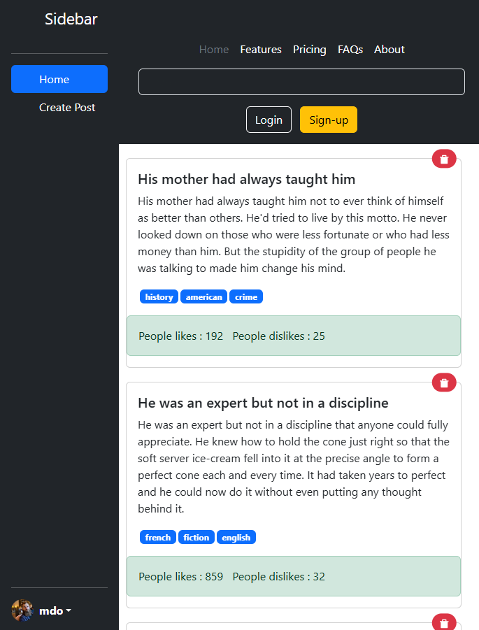
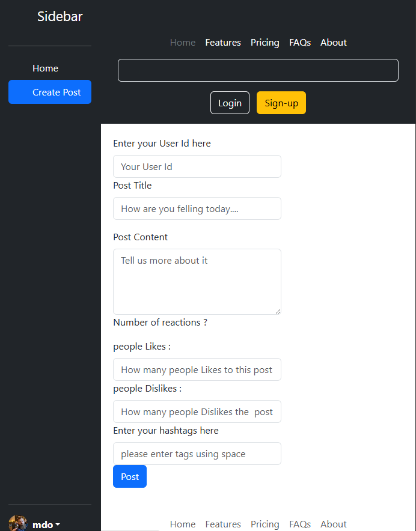

# Small Social Media App 🌐💬

A simple social media-style web application built using React where users can create posts and interact with the UI dynamically. This project focuses on React fundamentals such as component structure, props, state management, reusable UI components and using fake apis.

---

## 🚀 Features
- 📝 Create new posts
- 🗑️ Delete posts
- 🎨 Responsive and stylish UI
- ⚛️ Fully built using React components
- ⚡ Fast development environment using Vite

---

## 🛠️ Tech Stack
- **React.js**
- **JavaScript (ES6+)**
- **bootstrap**
- **Vite**

---

## 📸 Screenshots

> Add images inside `screenshots` folder and replace the image paths below

### ✅ Home Feed UI

### 📝 Add Post Section

---

## 🔧 How to Run Locally
- git clone https://github.com/arakhitasabata635/small-social-media-using-react
- cd small-social-media-using-react
- npm install
- npm run dev

## 🧠 What I Learned
- Component-based React architecture
- Managing dynamic UI with state
- Real-world CRUD UI patterns
- Working with Vite project setup
- working with rest apis

## 🙌 Author
**Arakhita Sabata**  
If you like this project, please ⭐ the repository!